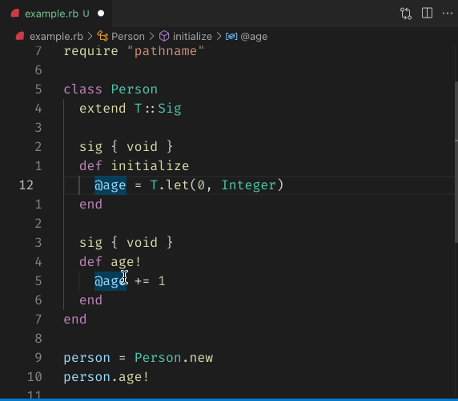

## Document Highlight

When your cursor is upon an item, other occurrences of the same item are highlighted.

For writable elements like constants or variables, their read/write occurrences are highlighted differently.

