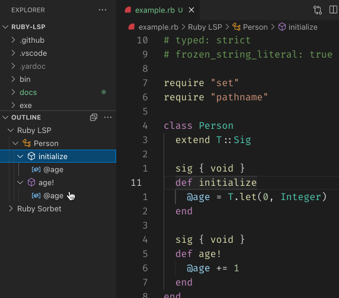

## Document Symbols (Navigation)

Document symbols are all the important names defined in a file, such as classes, variables, and methods.

(Not to be confused with the `symbol` type in Ruby)

VS Code uses this to populate breadcrumbs, build the Outline, and allow for fuzzy symbol searches.

Fuzzy symbol search can be accessed by opening the [Command Palette](command:workbench.action.quickOpen)
and typing `@`.

**Important:** Ruby LSP does not have support for Go To Definition or related features such as References.

For code which is typed using Sorbet, the [Sorbet Extension for VS Code](https://marketplace.visualstudio.com/items?itemName=sorbet.sorbet-vscode-extension) provides this functionality.

IntelliSense is only supported for typed files, elsewhere VS Code will fall back to basic token matching.
