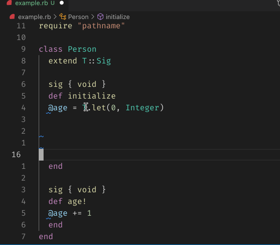

## Formatting

The formatting feature uses RuboCop to automatically format Ruby code, using the configuration of your project.

It has the same result as running `bundle exec rubocop file.rb --autocorrect`, but is almost instant:



It is recommended to enable `formatOnSave`, either per-project, or in your User settings, for example:

```json
"[ruby]": {
  "editor.formatOnSave": true
}
```

On very large files, **Format On Save** may run slowly. You can bypass it with **Save Without Formatting**.
