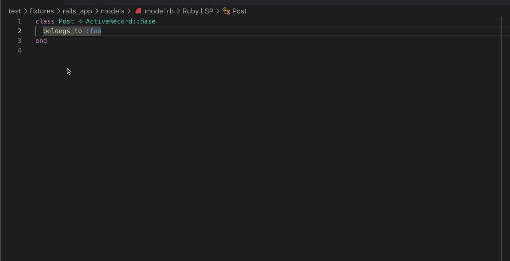

## Hover (Rails Documentation)

When hovering over a Rails method, such as `belongs_to`, a link to the official Rails documentation is provided.

**Important:** This feature only works on files typed with Sorbet.

