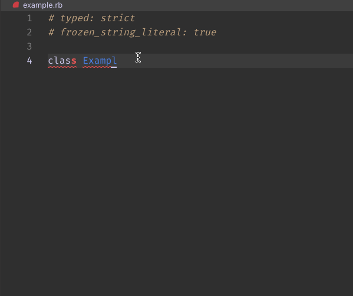

## On Type Formatting

On Type Formatting formats code as your are typing. For example, automatically adding `end` to class definitions:

```ruby
class Foo # <-- upon adding a line break, on type formatting is triggered
          # <-- cursor ends up here
end       # <-- end is automatically added
```


